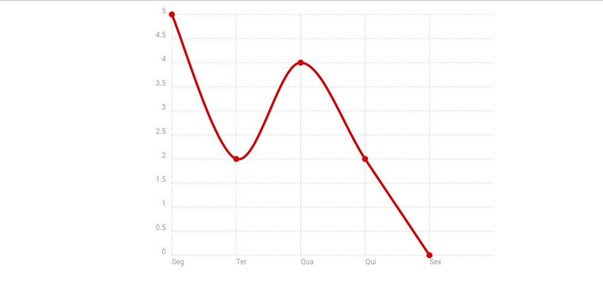

# Depois de apanhar tanto com vários tipos de Charts..
Eaí! Tudo bem?
Então, não sei se isso aqui é novidade pra vocês - ou vai ajudar em algo -, mas me ajudou muito em um momento triste da minha vida.

## O que são Charts?
*Charts* são nada mais nada menos que, aqueles gráficos que vocẽ sempre vê em alguns sites, medindo estatísticas de visitas, quantidade de publicações, coisas do tipo. 

Existem vários plugins e tipos de *Charts* bacanas, eu já usei o [Google Charts](https://developers.google.com/chart/), que no começo foi muito bom, mas não me acostumei com ele e/ou não foi "o suficiente pra mim".

Eu precisava inicialmente de um *Chart* no formato de linhas, apenas pra contagem de cadastros em um projeto meu. Até então eu usava o Google Charts mesmo, isto até ter que acessar em um monitor menor que o meu e ver alguns problemas com a responsividade.

Sim, eu tentei corrigir via CSS/JS, e li documentação do próprio Google Charts, pequisei em fóruns, mas não ficou do jeito que eu queria e muito menos customizado como eu queria.

## [O Chartist.js](http://gionkunz.github.io/chartist-js/)
Entre idas e vindas no Github e no Google, consegui encontrar [esse 'plugin' de Charts, o Chartist.js](http://gionkunz.github.io/chartist-js/).

Inicialmente me assustei com ele, porque já não acreditava ser tão fácil configurar um chart como a própria página dizia. Corri pra página de [exemplos](http://gionkunz.github.io/chartist-js/examples.html) e me maravilhei com aquele botãozinho que te permite fazer alterações ao vivo e à cores.

### Algumas vantagens
- --	Se você quiser, pode usar os scripts tanto localmente quanto remotamente
- --	Ele é responsivo, sem precisar definir nenhuma *media query*
- --	Ele tem um esquema de tamanhos incrível, usando proporções de tela(ou *aspect ratio*)
- --	Ele tem animações e trabalha muito bem com SVG
- --	Se você quiser estilizar algo, não vai precisar de um arquivo externo em JS ou coisa do tipo, porque ele te permite estilizar seu chart pelo próprio CSS - inclusive ele tem um arquivo em SCSS/SASS pra você usar como quiser
- --	Preciso falar mais?

## Baixando o Chartist.js
Chega de enrolação e vamos ao que interessa.

Como eu tinha dito, você não é obrigado à utilizar os scripts remotamente, se quiser pode baixar os scripts na sua máquina que eles terão a mesma eficiência. 

Pra começar, recomendo que você [clone o repositório do Chartist.js no GitHub](https://github.com/gionkunz/chartist-js), ou apenas baixe, dá no mesmo.


	git clone https://github.com/gionkunz/chartist-js.git


## Copiando os arquivos necessários
Se você olhar bem, vai perceber que ele veio com uma pasta chamada __dist__, é ela que você vai usar. O restante são exemplos e outras coisas que você pode ver por conta própria.

Dentro da pasta __dist__, tem uma pasta com os arquivos em .scss e os scripts do Chartist em JS e CSS. Ele também estão minificados, então, é de sua escolha qual utilizar, apenas __lembre-se de que é preciso um dos arquivos em CSS e um dos em JS__

Copie os arquivos e coloque-os no seu projeto, em seguida chame-os na sua página:

	<html>
		<head>
			<title>Título</title>
			<!-- link do chartist.css aqui -->
		</head>
		<body>
			<!-- conteúdo do seu site -->
			<!-- link do chartist.js aqui, ele precisa ficar no fim da página -->
		</body>
	</html>


Fique tranquilo porque o Chartist.js é feito puramente em JavaScript, sem jQuery. Então não precisa chamar a biblioteca do jQuery.

## Inserindo o Chartist.js no seu site
Você só vai precisar de uma única tag no seu site, pro Chartist.js entrar em ação:

	



Dá uma olhada nas classes desse div, viu? Percebeu o __ct-perfect-fourth__?
Então, aquilo lá é a proporção da tela, é assim que eles organizam o tamanho do chart. 
Se você quiser, pode usar tamanhos fixos, mas te garanto que usar as proporções de tela é melhor. E obviamente eles falam sobre as proporções de tela, ou melhor dizendo, aspect ratio. É fácil de customizar, eu garanto.

Agora, pra colocar os valores e as colunas, você precisa adicionar esse script no fim do seu site, logo após a chamada do JS:

		var data = {
		  // As labels que podem conter qualquer tipo de valor, entre aspas simples
		  labels: ['Seg', 'Ter', 'Qua', 'Qui', 'Sex'],
		  // Um array que contém outros arrays relacionados a cada label que você usa
		  series: [
		    [5, 2, 4, 2, 0]
		  ]
		};

		// Isto cria um novo objeto Chartist do tipo Line, onde nós passamos o nosso seletor
		// para definir onde será nosso chart, e o segundo parâmetro define os dados do nosso objeto
		new Chartist.Line('.ct-chart', data);

Eis o resultado:

Legal né?

Bom, por hoje é só.
Eu espero que isso tenha sido útil. O que você achou?

Usa algum outro plugin? O que faz? Comenta aí!

Alguns links:

[Site do Chartist.js](http://gionkunz.github.io/chartist-js)

[Link do repositório do Chartist.js no Github](https://github.com/gionkunz/chartist-js)
